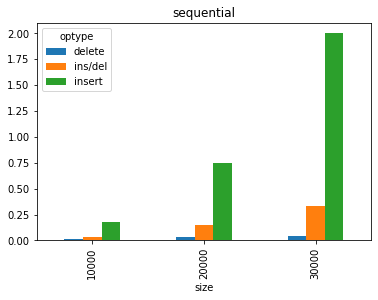
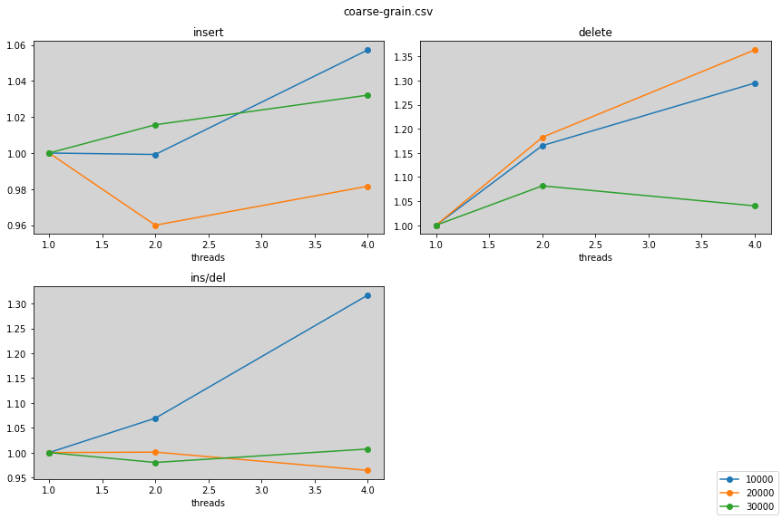
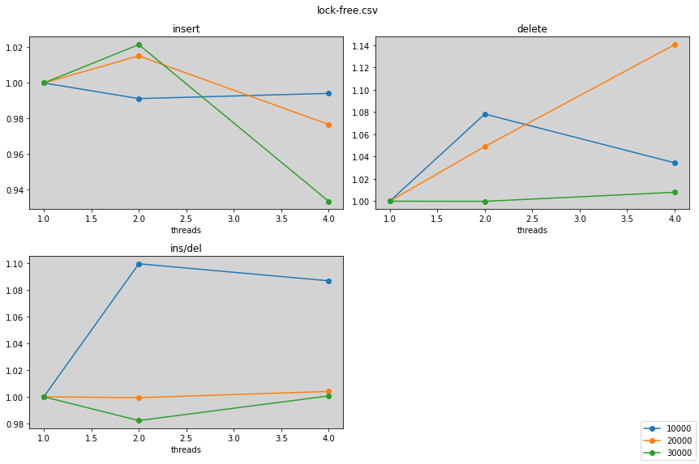
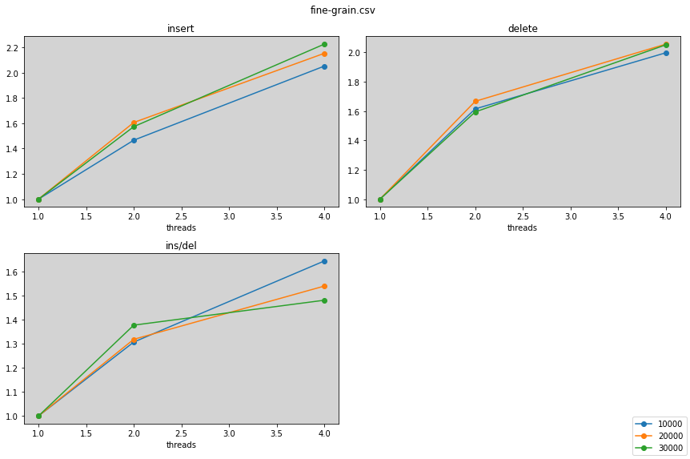

# Requirements

## Hardware
- Tested on debian-like machine (pop-os to be exact), but ubuntu probably works

## Software
- Tested with g++ --version=10.3.0
```
sudo apt-get install g++ // or
sudo apt-get build-essential
```
-  Install **openMP**
```
sudo apt-get install libomp-dev
```
**openMP** is a library that offers support for seamless parallelization through thread launching. As the programmer, you only need to identify parts of your code feeble for parallelization, while the library itself is an abstractions that helps with loop indexing, thread launching, built-in locks, and is portable on different os, making it a nice option for users who don't care about hardware optimations for every different machine. 

For the graphing tools we will need python3 and matplotlib
```
sudo apt-get install python
# In this repository
python3 -m venv venv
source venv/bin/activate
pip install matplotlib
```


# Description

Follow this [youtube link from Geometry Lab](https://www.youtube.com/watch?v=NDGpsfwAaqo&t=705s&ab_channel=GeometryLab) for a more detailed explanation of a skiplist. Here is a summary of the properties of skiplist.

| Insertion | Deletion | Search |
| --------- | -------- | ------ |
| log(n)    | log(n)   | log(n) |

\*expected time

The skiplist is able to achieve these marks because it uses layers/levels of linked list (visually) stacked on top of each other for *skipping* sections of a normal linked list (which has linear time search), and thus tries to emulate the methodology behind *binary search*.


In the next few sections, I analyze 4 different skiplist implementations: [sequential](https://github.com/bustin11/parallel-skiplist/tree/sequential), [coarse-grain](https://github.com/bustin11/parallel-skiplist/tree/coarse-grain), [fine-grain](https://github.com/bustin11/parallel-skiplist/tree/fine-grain), and [lock-free](https://github.com/bustin11/parallel-skiplist/tree/lock-free). If want to run yourself, make sure you follow the Software guidelines and pull all 4 branches.

## Grab Metrics


```python

def run(branch_name):
    !git checkout $branch_name
    !./run.sh
    !make clean

branch_names = ["sequential", "coarse-grain", "fine-grain", "lock-free"]
```


```python
!git stash 

!rm output.txt
for name in branch_names:
    !echo $name >> output.txt
    run(name)
```

    No local changes to save
    rm: cannot remove 'output.txt': No such file or directory
    Switched to branch 'sequential'
    Your branch is up to date with 'origin/sequential'.
    + set -e
    + make clean
    /bin/rm -rf *~ tests/test src/main  \
    tests/*.o src/*.o
    + '[' '' '!=' main ']'
    + make test
    g++ -m64 -std=c++20 tests/checker.cpp -Wall -Wno-unknown-pragmas -g -c -o tests/checker.o
    g++ -m64 -std=c++20 tests/test.cpp -Wall -Wno-unknown-pragmas -g -c -o tests/test.o
    g++ -m64 -std=c++20 skiplist.cpp -Wall -Wno-unknown-pragmas -g -c -o tests/skiplist.o
    g++ -m64 -std=c++20 -Wall -Wno-unknown-pragmas -o tests/test tests/checker.o tests/test.o -g tests/skiplist.o
    + echo '
    ===== Testing for correctness... =====
    '
    
    ===== Testing for correctness... =====
    
    + /home/justinhsu/parallel-skiplist/tests/test
    Number of threads:1
    Test 1[Simple]: 
    11
    Test 2[1 insertions at front]: 
      11
    5 11
    Test 3[1 insertions at back]: 
      11
      11
    5 11
    Test 4[1 insertions in the middle]: 
    2 5 11
    2 5 11
    Test 5[25 insertions insertions]: 
     ------ 12
     ------ 12 13 -- 16
     ------ 12 13 15 16 -- 18 19 ----- 23
    0 4 5 9 12 13 15 16 17 18 19 20 21 23 24
    Test 6[10000 insertions insertions randomly]: 
    Test 7[Simple]: 
    11
    11
    11
    Test 8[1 deletion at front]: 
    5
    5 11
    5 11
    Test 9[1 deletion at back]: 
    5
    5
    5 11
    Test 10[1 deletion in the middle]: 
      5
    2 5 11
    Test 11[25 deletions]: 
     --------------------- 13
     -------- 7 ---------- 13 ----------- 20
     -------- 7 8 -------- 13 15 -------- 20
     -- 4 5 6 7 8 10 ----- 13 15 -------- 20
    1 3 4 5 6 7 8 10 11 12 13 15 17 18 19 20 23
    Test 12[10000 random deletions]: 
    Test 13[100 random ins/del]: 
    Test 14[10000 random ins/del]: 
    All Tests Passed!
    + '[' '' '!=' test ']'
    + make
    g++ -m64 -std=c++20 src/main.cpp -Wall -Wno-unknown-pragmas -g -c -o src/main.o
    g++ -m64 -std=c++20 src/problems.cpp -Wall -Wno-unknown-pragmas -g -c -o src/problems.o
    g++ -m64 -std=c++20 skiplist.cpp -Wall -Wno-unknown-pragmas -g -c -o src/skiplist.o
    g++ -m64 -std=c++20 -Wall -Wno-unknown-pragmas -o src/main src/main.o src/problems.o -g src/skiplist.o
    + echo '
    ===== Benchmarking performance of skiplist... =====
    '
    
    ===== Benchmarking performance of skiplist... =====
    
    + /home/justinhsu/parallel-skiplist/src/main -f output.txt
    Number of threads:1
    ===================== ------------- =====================
    ===================== Problem size: =====================
    ===================== ------------- =====================
    size=10000, 1, 2, 3, 4, 5, 6
    [10000 insertions (3x avg)]: 0.175131
    [10000 deletions] (3x avg): 0.014631
    size=20000, 1, 2, 3, 4, 5, 6
    [20000 insertions (3x avg)]: 0.745516
    [20000 deletions] (3x avg): 0.030122
    size=30000, 1, 2, 3, 4, 5, 6
    [30000 insertions (3x avg)]: 1.999673
    [30000 deletions] (3x avg): 0.043340
    ========================> Done.
    
    =================---------------------- =================
    ================= Problem size (mixed): =================
    =================---------------------- =================
    size=10000, p=0.50, 1, 2, 3
    [10000 ins/del (3x avg)]: 0.011894
    size=20000, p=0.50, 1, 2, 3
    [20000 ins/del (3x avg)]: 0.049325
    size=30000, p=0.50, 1, 2, 3
    [30000 ins/del (3x avg)]: 0.111679
    ========================> Done.
    
    /bin/rm -rf *~ tests/test src/main  \
    tests/*.o src/*.o
    Switched to branch 'coarse-grain'
    Your branch is up to date with 'origin/coarse-grain'.
    + set -e
    + make clean
    /bin/rm -rf *~ tests/test src/main  \
    tests/*.o src/*.o
    + '[' '' '!=' main ']'
    + make test
    g++ -m64 -std=c++20 tests/checker.cpp -Wall -Wno-unknown-pragmas -g -fopenmp -c -o tests/checker.o
    g++ -m64 -std=c++20 tests/test.cpp -Wall -Wno-unknown-pragmas -g -fopenmp -c -o tests/test.o
    g++ -m64 -std=c++20 skiplist.cpp -Wall -Wno-unknown-pragmas -g -fopenmp -c -o tests/skiplist.o
    g++ -m64 -std=c++20 -Wall -Wno-unknown-pragmas -o tests/test tests/checker.o tests/test.o -g -fopenmp tests/skiplist.o
    + echo '
    ===== Testing for correctness... =====
    '
    
    ===== Testing for correctness... =====
    
    + /home/justinhsu/parallel-skiplist/tests/test -N 4
    Number of threads:1
    Test 1[Simple]: 
    11
    Test 2[1 insertions at front]: 
      11
    5 11
    Test 3[1 insertions at back]: 
      11
      11
    5 11
    Test 4[1 insertions in the middle]: 
    2 5 11
    2 5 11
    Test 5[25 insertions insertions]: 
     -- 5 -------------------------------- 20
     -- 5 ----------------- 14 16 17 ----- 20
     -- 5 ----- 10 -------- 14 16 17 ----- 20
     -- 5 - 7 - 10 -------- 14 16 17 18 -- 20
    0 2 5 6 7 9 10 11 12 13 14 16 17 18 19 20 24
    Test 6[10000 insertions insertions randomly]: 
    Test 7[Simple]: 
    11
    Test 8[1 deletion at front]: 
    5 11
    5 11
    Test 9[1 deletion at back]: 
      11
      11
    5 11
    5 11
    Test 10[1 deletion in the middle]: 
    2 5
    2 5 11
    Test 11[25 deletions]: 
     ---------------------- 14 16
     -- 5 ----------------- 14 16
     -- 5 ----- 10 -------- 14 16 17
     -- 5 - 7 - 10 -------- 14 16 17 ----- 20
    0 2 5 6 7 9 10 11 12 13 14 16 17 18 19 20 24
    Test 12[10000 random deletions]: 
    Test 13[100 random ins/del]: 
    Test 14[10000 random ins/del]: 
    All Tests Passed!
    + '[' '' '!=' test ']'
    + make
    g++ -m64 -std=c++20 src/main.cpp -Wall -Wno-unknown-pragmas -g -fopenmp -c -o src/main.o
    g++ -m64 -std=c++20 src/problems.cpp -Wall -Wno-unknown-pragmas -g -fopenmp -c -o src/problems.o
    g++ -m64 -std=c++20 skiplist.cpp -Wall -Wno-unknown-pragmas -g -fopenmp -c -o src/skiplist.o
    g++ -m64 -std=c++20 -Wall -Wno-unknown-pragmas -o src/main src/main.o src/problems.o -g -fopenmp src/skiplist.o
    + echo '
    ===== Benchmarking performance of skiplist... =====
    '
    
    ===== Benchmarking performance of skiplist... =====
    
    + echo threads=1
    + /home/justinhsu/parallel-skiplist/src/main -N 1 -f output.txt
    Number of threads:1
    ===================== ------------- =====================
    ===================== Problem size: =====================
    ===================== ------------- =====================
    size=10000, 1, 2, 3, 4, 5, 6
    [10000 insertions (3x avg)]: 0.286389
    [10000 deletions] (3x avg): 0.294177
    size=20000, 1, 2, 3, 4, 5, 6
    [20000 insertions (3x avg)]: 0.906305
    [20000 deletions] (3x avg): 0.392797
    size=30000, 1, 2, 3, 4, 5, 6
    [30000 insertions (3x avg)]: 2.196480
    [30000 deletions] (3x avg): 0.512629
    ========================> Done.
    
    =================---------------------- =================
    ================= Problem size (mixed): =================
    =================---------------------- =================
    size=10000, p=0.50, 1, 2, 3
    [10000 ins/del (3x avg)]: 0.228912
    size=20000, p=0.50, 1, 2, 3
    [20000 ins/del (3x avg)]: 0.692668
    size=30000, p=0.50, 1, 2, 3
    [30000 ins/del (3x avg)]: 1.559966
    ========================> Done.
    
    + echo threads=2
    + /home/justinhsu/parallel-skiplist/src/main -N 2 -f output.txt
    Number of threads:2
    ===================== ------------- =====================
    ===================== Problem size: =====================
    ===================== ------------- =====================
    size=10000, 1, 2, 3, 4, 5, 6
    [10000 insertions (3x avg)]: 0.286618
    [10000 deletions] (3x avg): 0.252480
    size=20000, 1, 2, 3, 4, 5, 6
    [20000 insertions (3x avg)]: 0.944116
    [20000 deletions] (3x avg): 0.332194
    size=30000, 1, 2, 3, 4, 5, 6
    [30000 insertions (3x avg)]: 2.162573
    [30000 deletions] (3x avg): 0.473954
    ========================> Done.
    
    =================---------------------- =================
    ================= Problem size (mixed): =================
    =================---------------------- =================
    size=10000, p=0.50, 1, 2, 3
    [10000 ins/del (3x avg)]: 0.214082
    size=20000, p=0.50, 1, 2, 3
    [20000 ins/del (3x avg)]: 0.692005
    size=30000, p=0.50, 1, 2, 3
    [30000 ins/del (3x avg)]: 1.591556
    ========================> Done.
    
    + echo threads=4
    + /home/justinhsu/parallel-skiplist/src/main -N 4 -f output.txt
    Number of threads:4
    ===================== ------------- =====================
    ===================== Problem size: =====================
    ===================== ------------- =====================
    size=10000, 1, 2, 3, 4, 5, 6
    [10000 insertions (3x avg)]: 0.270885
    [10000 deletions] (3x avg): 0.227197
    size=20000, 1, 2, 3, 4, 5, 6
    [20000 insertions (3x avg)]: 0.923311
    [20000 deletions] (3x avg): 0.288054
    size=30000, 1, 2, 3, 4, 5, 6
    [30000 insertions (3x avg)]: 2.128115
    [30000 deletions] (3x avg): 0.492861
    ========================> Done.
    
    =================---------------------- =================
    ================= Problem size (mixed): =================
    =================---------------------- =================
    size=10000, p=0.50, 1, 2, 3
    [10000 ins/del (3x avg)]: 0.173821
    size=20000, p=0.50, 1, 2, 3
    [20000 ins/del (3x avg)]: 0.718381
    size=30000, p=0.50, 1, 2, 3
    [30000 ins/del (3x avg)]: 1.548805
    ========================> Done.
    
    /bin/rm -rf *~ tests/test src/main  \
    tests/*.o src/*.o
    Switched to branch 'fine-grain'
    Your branch is up to date with 'origin/fine-grain'.
    + set -e
    + make clean
    /bin/rm -rf *~ tests/test src/main  \
    tests/*.o src/*.o
    + '[' '' '!=' main ']'
    + make test
    g++ -m64 -std=c++20 tests/checker.cpp -Wall -Wno-unknown-pragmas -g -fopenmp -c -o tests/checker.o
    g++ -m64 -std=c++20 tests/test.cpp -Wall -Wno-unknown-pragmas -g -fopenmp -c -o tests/test.o
    g++ -m64 -std=c++20 skiplist.cpp -Wall -Wno-unknown-pragmas -g -fopenmp -c -o tests/skiplist.o
    g++ -m64 -std=c++20 -Wall -Wno-unknown-pragmas -o tests/test tests/checker.o tests/test.o -g -fopenmp tests/skiplist.o
    + echo '
    ===== Testing for correctness... =====
    '
    
    ===== Testing for correctness... =====
    
    + /home/justinhsu/parallel-skiplist/tests/test -N 4
    Number of threads:4
    Test 1[Simple]: 
    11
    Test 2[1 insertions at front]: 
      11
    5 11
    Test 3[1 insertions at back]: 
      11
      11
    5 11
    Test 4[1 insertions in the middle]: 
    2 5 11
    2 5 11
    Test 5[25 insertions insertions]: 
    1 - 5
    1 - 5 ------------------- 17
    1 3 5 ------- 10 -------- 17
    1 3 5 6 7 8 9 10 13 14 15 17 19 20 21 23 24
    Test 6[10000 insertions insertions randomly]: 
    Test 7[Simple]: 
    11
    Test 8[1 deletion at front]: 
    5 11
    Test 9[1 deletion at back]: 
      11
      11
    5 11
    5 11
    Test 10[1 deletion in the middle]: 
    2
    2 5 11
    Test 11[25 deletions]: 
      2
      2 ------------------------ 24
      2 3 ---------------------- 24
    1 2 3 ---------------------- 24
    1 2 3 4 6 7 9 12 15 16 19 23 24
    Test 12[10000 random deletions]: 
    Test 13[100 random ins/del]: 
    Test 14[10000 random ins/del]: 
    All Tests Passed!
    + '[' '' '!=' test ']'
    + make
    g++ -m64 -std=c++20 src/main.cpp -Wall -Wno-unknown-pragmas -fopenmp -c -o src/main.o
    g++ -m64 -std=c++20 src/problems.cpp -Wall -Wno-unknown-pragmas -fopenmp -c -o src/problems.o
    g++ -m64 -std=c++20 skiplist.cpp -Wall -Wno-unknown-pragmas -fopenmp -c -o src/skiplist.o
    g++ -m64 -std=c++20 -Wall -Wno-unknown-pragmas -o src/main src/main.o src/problems.o -fopenmp src/skiplist.o
    + echo '
    ===== Benchmarking performance of skiplist... =====
    '
    
    ===== Benchmarking performance of skiplist... =====
    
    + echo threads=1
    + /home/justinhsu/parallel-skiplist/src/main -N 1 -f output.txt
    Number of threads:1
    ===================== ------------- =====================
    ===================== Problem size: =====================
    ===================== ------------- =====================
    size=10000, 1, 2, 3, 4, 5, 6
    [10000 insertions (3x avg)]: 1.081400
    [10000 deletions] (3x avg): 0.114225
    size=20000, 1, 2, 3, 4, 5, 6
    [20000 insertions (3x avg)]: 4.734094
    [20000 deletions] (3x avg): 0.246249
    size=30000, 1, 2, 3, 4, 5, 6
    [30000 insertions (3x avg)]: 10.765573
    [30000 deletions] (3x avg): 0.373920
    ========================> Done.
    
    =================---------------------- =================
    ================= Problem size (mixed): =================
    =================---------------------- =================
    size=10000, p=0.00, 1, 2, 3
    [10000 ins/del (3x avg)]: 0.096989
    size=20000, p=0.00, 1, 2, 3
    [20000 ins/del (3x avg)]: 0.185772
    size=30000, p=0.00, 1, 2, 3
    [30000 ins/del (3x avg)]: 0.277501
    ========================> Done.
    
    + echo threads=2
    + /home/justinhsu/parallel-skiplist/src/main -N 2 -f output.txt
    Number of threads:2
    ===================== ------------- =====================
    ===================== Problem size: =====================
    ===================== ------------- =====================
    size=10000, 1, 2, 3, 4, 5, 6
    [10000 insertions (3x avg)]: 0.737554
    [10000 deletions] (3x avg): 0.070735
    size=20000, 1, 2, 3, 4, 5, 6
    [20000 insertions (3x avg)]: 2.947450
    [20000 deletions] (3x avg): 0.147768
    size=30000, 1, 2, 3, 4, 5, 6
    [30000 insertions (3x avg)]: 6.843200
    [30000 deletions] (3x avg): 0.234566
    ========================> Done.
    
    =================---------------------- =================
    ================= Problem size (mixed): =================
    =================---------------------- =================
    size=10000, p=0.00, 1, 2, 3
    [10000 ins/del (3x avg)]: 0.074196
    size=20000, p=0.00, 1, 2, 3
    [20000 ins/del (3x avg)]: 0.140881
    size=30000, p=0.00, 1, 2, 3
    [30000 ins/del (3x avg)]: 0.201456
    ========================> Done.
    
    + echo threads=4
    + /home/justinhsu/parallel-skiplist/src/main -N 4 -f output.txt
    Number of threads:4
    ===================== ------------- =====================
    ===================== Problem size: =====================
    ===================== ------------- =====================
    size=10000, 1, 2, 3, 4, 5, 6
    [10000 insertions (3x avg)]: 0.527046
    [10000 deletions] (3x avg): 0.057200
    size=20000, 1, 2, 3, 4, 5, 6
    [20000 insertions (3x avg)]: 2.198930
    [20000 deletions] (3x avg): 0.119772
    size=30000, 1, 2, 3, 4, 5, 6
    [30000 insertions (3x avg)]: 4.837188
    [30000 deletions] (3x avg): 0.182304
    ========================> Done.
    
    =================---------------------- =================
    ================= Problem size (mixed): =================
    =================---------------------- =================
    size=10000, p=0.00, 1, 2, 3
    [10000 ins/del (3x avg)]: 0.058989
    size=20000, p=0.00, 1, 2, 3
    [20000 ins/del (3x avg)]: 0.120643
    size=30000, p=0.00, 1, 2, 3
    [30000 ins/del (3x avg)]: 0.187364
    ========================> Done.
    
    /bin/rm -rf *~ tests/test src/main  \
    tests/*.o src/*.o
    Switched to branch 'lock-free'
    Your branch is up to date with 'origin/lock-free'.
    + set -e
    + make clean
    /bin/rm -rf *~ tests/test src/main  \
    tests/*.o src/*.o
    + '[' '' '!=' main ']'
    + make test
    g++ -m32 -std=c++20 -msse2 tests/checker.cpp -Wall -Wno-unknown-pragmas -g  -c -o tests/checker.o
    g++ -m32 -std=c++20 -msse2 tests/test.cpp -Wall -Wno-unknown-pragmas -g  -c -o tests/test.o
    g++ -m32 -std=c++20 -msse2 skiplist.cpp -Wall -Wno-unknown-pragmas -g  -c -o tests/skiplist.o
    g++ -m32 -std=c++20 -msse2 -Wall -Wno-unknown-pragmas -o tests/test tests/checker.o tests/test.o -g  tests/skiplist.o -fopenmp -latomic
    + echo '
    ===== Testing for correctness... =====
    '
    
    ===== Testing for correctness... =====
    
    + /home/justinhsu/parallel-skiplist/tests/test -N 4
    Number of threads:4
    Test 1[Simple]: 
    11
    Test 2[1 insertions at front]: 
      11
    5 11
    Test 3[1 insertions at back]: 
      11
      11
    5 11
    Test 4[1 insertions in the middle]: 
    2 5 11
    2 5 11
    Test 5[25 insertions insertions]: 
     ------ 8
    1 ----- 8
    1 ----- 8 9 -- 11 12 ----- 17 18
    1 2 4 7 8 9 10 11 12 13 15 17 18 21 22 24
    Test 6[10000 insertions insertions randomly]: 
    Test 7[Simple]: 
    11
    
    Test 8[1 deletion at front]: 
      11
      11
    5 11
    11
    11
    11
    Test 9[1 deletion at back]: 
    5
    5 11
    Test 10[1 deletion in the middle]: 
    2
    2
    2 5 11
    2 5 11
    Test 11[25 deletions]: 
     ------ 8
    1 ----- 8
    1 ----- 8 9 -- 11 12 ----- 17 18
    1 2 4 7 8 9 10 11 12 13 15 17 18 21 22 24
    Test 12[10000 random deletions]: 
    Test 13[100 random ins/del]: 
    Test 14[10000 random ins/del]: 
    All Tests Passed!
    + '[' '' '!=' test ']'
    + make
    g++ -m32 -std=c++20 -msse2 src/main.cpp -Wall -Wno-unknown-pragmas  -c -o src/main.o
    g++ -m32 -std=c++20 -msse2 src/problems.cpp -Wall -Wno-unknown-pragmas  -c -o src/problems.o
    g++ -m32 -std=c++20 -msse2 skiplist.cpp -Wall -Wno-unknown-pragmas  -c -o src/skiplist.o
    g++ -m32 -std=c++20 -msse2 -Wall -Wno-unknown-pragmas -o src/main src/main.o src/problems.o  src/skiplist.o -fopenmp -latomic
    + echo '
    ===== Benchmarking performance of skiplist... =====
    '
    
    ===== Benchmarking performance of skiplist... =====
    
    + echo threads=1
    + /home/justinhsu/parallel-skiplist/src/main -N 1 -f output.txt
    Number of threads:1
    ===================== ------------- =====================
    ===================== Problem size: =====================
    ===================== ------------- =====================
    size=10000, 1, 2, 3, 4, 5, 6
    [10000 insertions (3x avg)]: 0.330473
    [10000 deletions] (3x avg): 0.062647
    size=20000, 1, 2, 3, 4, 5, 6
    [20000 insertions (3x avg)]: 1.396846
    [20000 deletions] (3x avg): 0.138240
    size=30000, 1, 2, 3, 4, 5, 6
    [30000 insertions (3x avg)]: 4.822068
    [30000 deletions] (3x avg): 0.206497
    ========================> Done.
    
    =================---------------------- =================
    ================= Problem size (mixed): =================
    =================---------------------- =================
    size=10000, p=0.50, 1, 2, 3
    [10000 ins/del (3x avg)]: 0.094196
    size=20000, p=0.50, 1, 2, 3
    [20000 ins/del (3x avg)]: 0.311771
    size=30000, p=0.50, 1, 2, 3
    [30000 ins/del (3x avg)]: 0.681200
    ========================> Done.
    
    + echo threads=2
    + /home/justinhsu/parallel-skiplist/src/main -N 2 -f output.txt
    Number of threads:2
    ===================== ------------- =====================
    ===================== Problem size: =====================
    ===================== ------------- =====================
    size=10000, 1, 2, 3, 4, 5, 6
    [10000 insertions (3x avg)]: 0.333396
    [10000 deletions] (3x avg): 0.058100
    size=20000, 1, 2, 3, 4, 5, 6
    [20000 insertions (3x avg)]: 1.375927
    [20000 deletions] (3x avg): 0.131771
    size=30000, 1, 2, 3, 4, 5, 6
    [30000 insertions (3x avg)]: 4.720317
    [30000 deletions] (3x avg): 0.206519
    ========================> Done.
    
    =================---------------------- =================
    ================= Problem size (mixed): =================
    =================---------------------- =================
    size=10000, p=0.50, 1, 2, 3
    [10000 ins/del (3x avg)]: 0.085658
    size=20000, p=0.50, 1, 2, 3
    [20000 ins/del (3x avg)]: 0.311977
    size=30000, p=0.50, 1, 2, 3
    [30000 ins/del (3x avg)]: 0.693533
    ========================> Done.
    
    + echo threads=4
    + /home/justinhsu/parallel-skiplist/src/main -N 4 -f output.txt
    Number of threads:4
    ===================== ------------- =====================
    ===================== Problem size: =====================
    ===================== ------------- =====================
    size=10000, 1, 2, 3, 4, 5, 6
    [10000 insertions (3x avg)]: 0.332416
    [10000 deletions] (3x avg): 0.060559
    size=20000, 1, 2, 3, 4, 5, 6
    [20000 insertions (3x avg)]: 1.430180
    [20000 deletions] (3x avg): 0.121198
    size=30000, 1, 2, 3, 4, 5, 6
    [30000 insertions (3x avg)]: 5.165546
    [30000 deletions] (3x avg): 0.204855
    ========================> Done.
    
    =================---------------------- =================
    ================= Problem size (mixed): =================
    =================---------------------- =================
    size=10000, p=0.50, 1, 2, 3
    [10000 ins/del (3x avg)]: 0.086660
    size=20000, p=0.50, 1, 2, 3
    [20000 ins/del (3x avg)]: 0.310520
    size=30000, p=0.50, 1, 2, 3
    [30000 ins/del (3x avg)]: 0.680758
    ========================> Done.
    
    /bin/rm -rf *~ tests/test src/main  \
    tests/*.o src/*.o


## Analysis

### Python Libraries


```python
%pip install matplotlib
%pip install numpy 
%pip install pandas 

```

    Requirement already satisfied: matplotlib in ./venv/lib/python3.9/site-packages (3.5.2)
    Requirement already satisfied: cycler>=0.10 in ./venv/lib/python3.9/site-packages (from matplotlib) (0.11.0)
    Requirement already satisfied: kiwisolver>=1.0.1 in ./venv/lib/python3.9/site-packages (from matplotlib) (1.4.3)
    Requirement already satisfied: numpy>=1.17 in ./venv/lib/python3.9/site-packages (from matplotlib) (1.23.0)
    Requirement already satisfied: pillow>=6.2.0 in ./venv/lib/python3.9/site-packages (from matplotlib) (9.1.1)
    Requirement already satisfied: pyparsing>=2.2.1 in ./venv/lib/python3.9/site-packages (from matplotlib) (3.0.9)
    Requirement already satisfied: fonttools>=4.22.0 in ./venv/lib/python3.9/site-packages (from matplotlib) (4.33.3)
    Requirement already satisfied: packaging>=20.0 in ./venv/lib/python3.9/site-packages (from matplotlib) (21.3)
    Requirement already satisfied: python-dateutil>=2.7 in ./venv/lib/python3.9/site-packages (from matplotlib) (2.8.2)
    Requirement already satisfied: six>=1.5 in ./venv/lib/python3.9/site-packages (from python-dateutil>=2.7->matplotlib) (1.16.0)
    Note: you may need to restart the kernel to use updated packages.
    Requirement already satisfied: numpy in ./venv/lib/python3.9/site-packages (1.23.0)
    Note: you may need to restart the kernel to use updated packages.
    Requirement already satisfied: pandas in ./venv/lib/python3.9/site-packages (1.4.2)
    Requirement already satisfied: pytz>=2020.1 in ./venv/lib/python3.9/site-packages (from pandas) (2022.1)
    Requirement already satisfied: numpy>=1.18.5 in ./venv/lib/python3.9/site-packages (from pandas) (1.23.0)
    Requirement already satisfied: python-dateutil>=2.8.1 in ./venv/lib/python3.9/site-packages (from pandas) (2.8.2)
    Requirement already satisfied: six>=1.5 in ./venv/lib/python3.9/site-packages (from python-dateutil>=2.8.1->pandas) (1.16.0)
    Note: you may need to restart the kernel to use updated packages.


```python

import pandas as pd
import numpy as np
import matplotlib.pyplot as plt
```

### Data conversion


```python
def convert_to_csv():

    import re
    anyDigit = '([0-9]+\.?[0-9]*|\.[0-9]+)'
    filename = ''
    with open('output.txt') as f:
        threads = 0
        for line in f:

            # 2) check for threads argument
            matchthread = re.match(f'threads=([0-9]+)', line)
            if matchthread:
                threads = matchthread.group(1)
                continue
            
            # 3) parse the line to get the information
            match = re.match(f'size={anyDigit}, (\S+) time={anyDigit}', line)
            if match and filename: # need a match with a filename
                with open(filename, 'a') as curr:
                    if threads:
                        curr.write(','.join([match.group(2), match.group(1), threads, match.group(3)]) + '\n')
                    else:
                        curr.write(','.join([match.group(2), match.group(1), match.group(3)]) + '\n')
            else:
                # 1) create the file with the name
                filename = line.strip() + '.csv'
                with open(filename, 'w') as curr:
                    if filename == 'sequential.csv':
                        curr.write('optype,size,time\n')
                    else:
                        curr.write('optype,size,threads,time\n')
                threads = 0


def convert_to_df():
    dfs = {}
    import glob
    for file in glob.glob("*.csv"):
        dfs[file] = pd.read_csv(file)
    return dfs

```


```python
convert_to_csv()
dfs = convert_to_df()

dfs['sequential.csv']
dfs['fine-grain.csv']
```


<div>
<style scoped>
    .dataframe tbody tr th:only-of-type {
        vertical-align: middle;
    }

    .dataframe tbody tr th {
        vertical-align: top;
    }

    .dataframe thead th {
        text-align: right;
    }
</style>
<table border="1" class="dataframe">
  <thead>
    <tr style="text-align: right;">
      <th></th>
      <th>optype</th>
      <th>size</th>
      <th>threads</th>
      <th>time</th>
    </tr>
  </thead>
  <tbody>
    <tr>
      <th>0</th>
      <td>insert</td>
      <td>10000</td>
      <td>1</td>
      <td>3.244201</td>
    </tr>
    <tr>
      <th>1</th>
      <td>delete</td>
      <td>10000</td>
      <td>1</td>
      <td>0.342676</td>
    </tr>
    <tr>
      <th>2</th>
      <td>insert</td>
      <td>20000</td>
      <td>1</td>
      <td>14.202283</td>
    </tr>
    <tr>
      <th>3</th>
      <td>delete</td>
      <td>20000</td>
      <td>1</td>
      <td>0.738747</td>
    </tr>
    <tr>
      <th>4</th>
      <td>insert</td>
      <td>30000</td>
      <td>1</td>
      <td>32.296719</td>
    </tr>
    <tr>
      <th>5</th>
      <td>delete</td>
      <td>30000</td>
      <td>1</td>
      <td>1.121761</td>
    </tr>
    <tr>
      <th>6</th>
      <td>ins/del</td>
      <td>10000</td>
      <td>1</td>
      <td>0.290966</td>
    </tr>
    <tr>
      <th>7</th>
      <td>ins/del</td>
      <td>20000</td>
      <td>1</td>
      <td>0.557316</td>
    </tr>
    <tr>
      <th>8</th>
      <td>ins/del</td>
      <td>30000</td>
      <td>1</td>
      <td>0.832504</td>
    </tr>
    <tr>
      <th>9</th>
      <td>insert</td>
      <td>10000</td>
      <td>2</td>
      <td>2.212662</td>
    </tr>
    <tr>
      <th>10</th>
      <td>delete</td>
      <td>10000</td>
      <td>2</td>
      <td>0.212206</td>
    </tr>
    <tr>
      <th>11</th>
      <td>insert</td>
      <td>20000</td>
      <td>2</td>
      <td>8.842350</td>
    </tr>
    <tr>
      <th>12</th>
      <td>delete</td>
      <td>20000</td>
      <td>2</td>
      <td>0.443305</td>
    </tr>
    <tr>
      <th>13</th>
      <td>insert</td>
      <td>30000</td>
      <td>2</td>
      <td>20.529602</td>
    </tr>
    <tr>
      <th>14</th>
      <td>delete</td>
      <td>30000</td>
      <td>2</td>
      <td>0.703699</td>
    </tr>
    <tr>
      <th>15</th>
      <td>ins/del</td>
      <td>10000</td>
      <td>2</td>
      <td>0.222589</td>
    </tr>
    <tr>
      <th>16</th>
      <td>ins/del</td>
      <td>20000</td>
      <td>2</td>
      <td>0.422644</td>
    </tr>
    <tr>
      <th>17</th>
      <td>ins/del</td>
      <td>30000</td>
      <td>2</td>
      <td>0.604369</td>
    </tr>
    <tr>
      <th>18</th>
      <td>insert</td>
      <td>10000</td>
      <td>4</td>
      <td>1.581137</td>
    </tr>
    <tr>
      <th>19</th>
      <td>delete</td>
      <td>10000</td>
      <td>4</td>
      <td>0.171601</td>
    </tr>
    <tr>
      <th>20</th>
      <td>insert</td>
      <td>20000</td>
      <td>4</td>
      <td>6.596789</td>
    </tr>
    <tr>
      <th>21</th>
      <td>delete</td>
      <td>20000</td>
      <td>4</td>
      <td>0.359316</td>
    </tr>
    <tr>
      <th>22</th>
      <td>insert</td>
      <td>30000</td>
      <td>4</td>
      <td>14.511565</td>
    </tr>
    <tr>
      <th>23</th>
      <td>delete</td>
      <td>30000</td>
      <td>4</td>
      <td>0.546913</td>
    </tr>
    <tr>
      <th>24</th>
      <td>ins/del</td>
      <td>10000</td>
      <td>4</td>
      <td>0.176966</td>
    </tr>
    <tr>
      <th>25</th>
      <td>ins/del</td>
      <td>20000</td>
      <td>4</td>
      <td>0.361928</td>
    </tr>
    <tr>
      <th>26</th>
      <td>ins/del</td>
      <td>30000</td>
      <td>4</td>
      <td>0.562093</td>
    </tr>
  </tbody>
</table>
</div>


### Sequential Baseline


```python
# Sequential https://towardsdatascience.com/reshaping-a-dataframe-with-pandas-stack-and-unstack-925dc9ce1289
# https://stackoverflow.com/questions/59204445/how-to-do-i-groupby-count-and-then-plot-a-bar-chart-in-pandas
df = dfs['sequential.csv']
df.pivot_table(index='size', values='time', columns='optype').plot(kind='bar', legend=True, title='sequential')
```


    <AxesSubplot:title={'center':'sequential'}, xlabel='size'>


    

    


### Speedup Graphs


```python
# https://stackoverflow.com/questions/41309467/matplotlib-plot-multiple-lines-per-time-series-subplot

optypes = ['insert', 'delete', 'ins/del']
for name, df in dfs.items():
    if name != 'sequential.csv':
        fig, axes = plt.subplots(nrows=2, ncols=2, figsize=(12,8))
        # create 2d -> 1d array
        axes = axes.ravel() 
        # remove last axes
        fig.delaxes(axes[-1])
        df = df.pivot_table(index='threads', values='time', columns=['optype', 'size'])
        # print(df)
        for i, optype in enumerate(optypes): # colname = first column which is optype
            unnormalized_series = df[optype] # a series is one columns
            row1 = unnormalized_series.loc[1] # thread 1,2, or 4, series[10000] is column
            series = row1 / unnormalized_series
            series.plot(kind='line', legend=False, title=optype, ax=axes[i], marker='o')
            if i == 2:
                handles, labels = axes[i].get_legend_handles_labels()
                fig.legend(handles, labels, loc='lower right', prop={'size': 10})
            axes[i].set_facecolor('lightgray')

                # this makes lower right relative to the last axes
                # axes[i].legend(loc='lower right')
        
        # prevent overlapping subplots
        fig.suptitle(name)
        fig.tight_layout() 
        # fig.patch.set_facecolor('gray')
```


    

    


    

    


    

    


I leave much of the analysis and observations up to you. Some questions to get you thinking are:
1) What is the overall trend/performance
2) Compare across different operations, what makes some some operations witness better speedup than others
   1) Why do you think this is the case
   2) Use `perf` to to specific points (hint: checkout the other branches to find out I used perf. Malloc is an expensive operation)
   3) Is your hypothesis confirmed?
3) Try scaling this for more threads in the code
4) Which sizes have better speedup, and why do you think so?
5) Why do we not achieve perfect speedup?
6) Compare fine-grain against lock-free, which performed better and why?
7) Compare sequential against the concurrent versions. Did you get what you expected?
