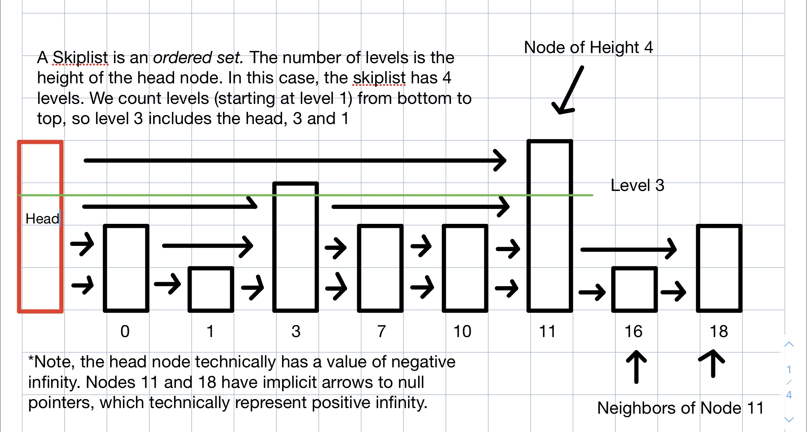
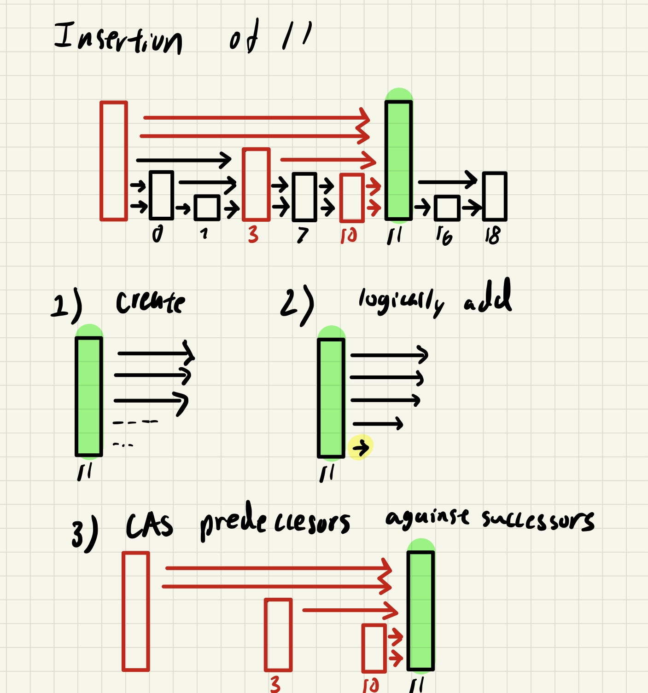
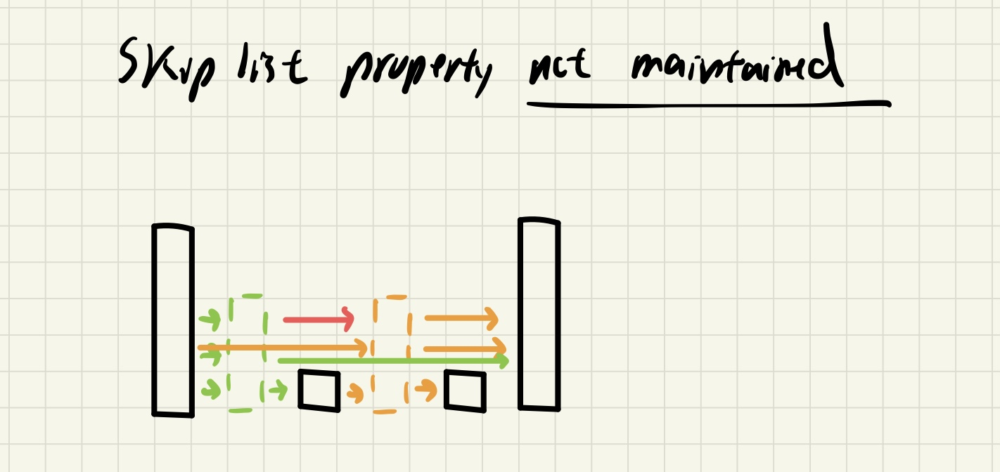
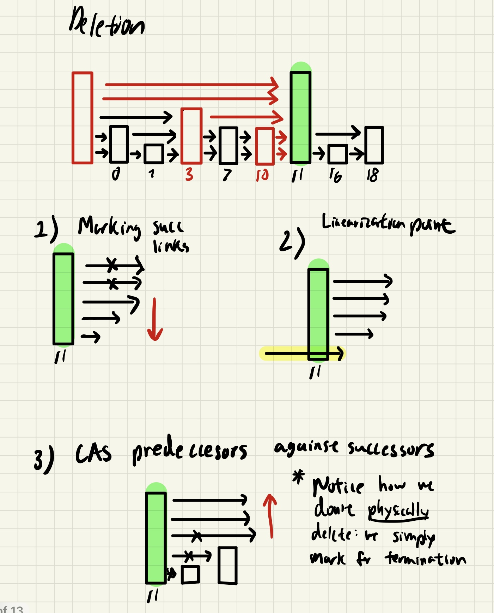
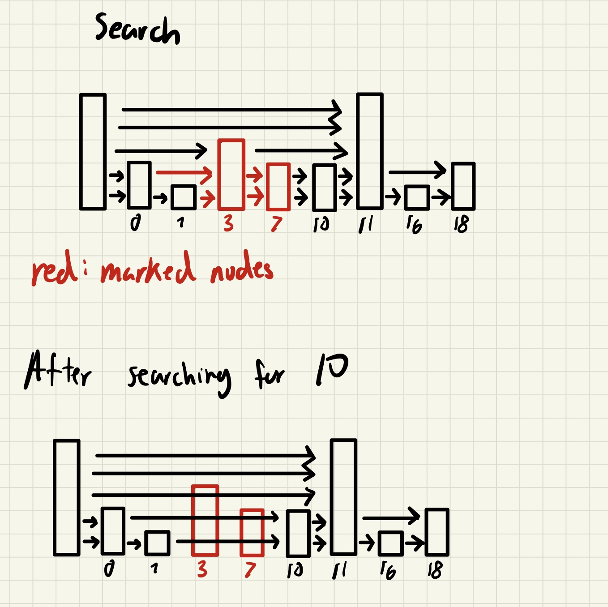

# Requirements

## Hardware
- Tested on debian-like machine (pop-os to be exact), but ubuntu probably works. CPU information can be found https://ark.intel.com/content/www/us/en/ark/products/208658/intel-core-i51135g7-processor-8m-cache-up-to-4-20-ghz.html. Main point is that I have 4 cores, but can run 8 threads ("simultaneously") since intel supports hardware threads.


## Software
- Tested with g++ --version=10.3.0
```
sudo apt-get install g++ // or
sudo apt-get build-essential
```
-  Install **openMP**
```
sudo apt-get install libomp-dev
```

**openMP** is a library that offers support for seamless parallelization through thread launching. As the programmer, you only need to identify parts of your code feeble for parallelization, while the library itself is an abstractions that helps with loop indexing, thread launching, built-in locks, and is portable on different os, making it a nice option for users who don't care about hardware optimations for every different machine. 

# How to Run
```
# for just testing
make test
tests/test -N <numThreads> -T <problem id>
# for just benchmarking
make
src/main -N <numThreads> -T <problem id>
# for testing and benchmarking
# ./run.sh
```
# Description

Follow this [youtube link from Geometry Lab](https://www.youtube.com/watch?v=NDGpsfwAaqo&t=705s&ab_channel=GeometryLab) for a more detailed explanation of a skiplist. Here is a summary of the properties of skiplist. 

| Insertion | Deletion | Search |
| --------- | -------- | ------ |
| log(n)    | log(n)   | log(n) |

\*expected time

The skiplist is able to achieve these marks because it uses layers/levels of linked list (visually) stacked on top of each other for *skipping* sections of a normal linked list (which has linear time search), and thus tries to emulate the methodology behind *binary search*. 



In the following sections, I will assume you are familiar with these terms:

|      |                                                                                                                           |
| ---- | --------------------------------------------------------------------------------------------------------------------------
**Node**   | A node is a single object (simliar to a linked list) connected to other multiple nodes. Each node has a specific *height*.
**Head**   | The beginning node. Often labeled as a dummy or sentinel node helpful for insertion and deletion.
**Neighbors**   | The neighbors *from* a *node* are its immediate connections. Note the the skiplist can be implemented as a layer of doubly linked lists, but in my implementation, we use a singly linked lists, so the neighbors are always to the right. 
**Height** | The height of a node is the number connections it connects to. Or it's the number of neighbors to the right. 
**Level**  | The level is the horizontal cross section of the skiplist. For a skiplist of height 5, there are 5 different levels.


In the code, we *attempt* to maintain the **skiplist property**, where higher levels are sublists of lower levels.

Finally, whenever I mention `delete`, it is defined as `remove` in the code itself. (Insert is still insert)

# Lock-Free
When we describe a data-structure that is *lock-free* or non-blocking, we mean to say that there is guaranteed system-wide progress. Wait-free, a stronger term, describes data-structures that make per-thread progress. A nice example (if you have kids) is to tell your kids to clean the house when they are out for dinner. When they come back, the house is clean. That is system-wide progress. But we don't know whether each kid did their share of work. Maybe the older sibling did all of the work while the younger one played with legos. A more concrete illustration occurs when some threads are blocked while other threads continue working. That is not per-thread progress. Wait-free is a stronger guarantee than lock-free, though sometimes the two terms are conflated.

We can achieve lock-free programming through the usage of [atomics](https://en.cppreference.com/w/cpp/atomic/atomic). In a similar manner that atoms are the "smallest" unit of matter that cannot be broken into multiple pieces, atomics (in c++) are wrappers that allow us update pointers or variable in "one shot". Now who cares? Well this solves the [ABA problem](https://en.wikipedia.org/wiki/ABA_problem#:~:text=In%20multithreaded%20computing%2C%20the%20ABA,indicate%20%22nothing%20has%20changed%22.) TL;DR, when multiple threads read-modify-write a variable, one thread may read a stale value, but atomics prevent this issue by bundling the read-modify-write operation in a package. 

In the lock-free version, we won't be able to main tain the skiplist property, unlike in the fine-grain version.

## Linearizability 
(credit to The Art of Multiprocessor Programming)
**Linearizability** is the notion that preserves the real-time behavior of a method at instantaneous moments. Most non-blocking data structures invoke this property, and it will help us formalize and prove that our operations are not enduring race conditions. With linearizability, we can theoretically catalogue when each method was called, and put each timestamp in a record book. If someone who has never read the code, opened the record book, and tried to deduce what the skiplist contained, they would be able to do it successfully. This is what is nice about linearizability. It's stronger than **sequential consistency** because it relates to *time* rather than *program order*. In real world systems, methods take some fraction of time to perform, which is why we care about linearization so much.

We can identify where each *Linearization point* occurs in `insert` and `delete`. 

# Implementation Details
Here we will describe some subtle details when implementing a lock-free skiplist. 

## Marking
Like in the [fine-grain](https://github.com/bustin11/parallel-skiplist/tree/fine-grain) version, we will continue to use the idea of marking. **Marking** a node means that it is logically deleted. We say "logically" because it is up to the desginer to determine how the node will be physically deleted. A node could be physically there but logically removed. If this doesn't make sense now, it will be cleared later how we will use marking and what is meant by logical vs. physical operations. Unlike the fine-grain version, we do not keep the idea of *fully-linked* nodes.

## Atomics
Now marking a node should really be marking the connection to a node. Therefore, we need to support atomic updating of whether a node is marked. We do this by first wrapping each node to be a `MarkableReference`.
```
template typename<T>
struct alignas(8) MarkableReference {
    T* next;
    bool mark;
}
```
Then we can wrap this with another struct to form an `AtomicMarkableReference`. The `alignas(8)` ensures that the struct is 8-byte aligned on a 32-bit system. For 64-bit systems, use the `-m32` flag.
```
template typename<T>
struct AtomicMarkableReference {
    atomic<MarkableReference<T>> reference;
    T* get_reference();                     // returns a reference
    T* get(bool& mark);                     // returns reference, with mark
    void set(T* newRef);                    // set reference
    void set_marked();                      // set reference and mark
    bool CAS(T* expected, T* newRef         // compare and swap, return true if success
    , bool expectedMark, bool newMark)
}
```
The `templates` are there to form generic classes. We can then use these templates to form atomic nodes, which is type `T`. 

One question that might be asked is why I go over the implementation of the atomic markable references. "I only care about the algorithm and logic that went behind". If this is you, then you are either incredibly smart with object-oriented design, or jump to hasty to conclusions. Either way, when you look at the `atomics` class in c++, it is a little annoying to write lots of code to load just one reference, so hiding this and adding an abstraction is vital for maintaing the code and understanding it.

## Insertion
Finally, we come to 1 of the 3 main operations of this skiplist: `insert`. Of course, we search for the insertion point and collect the predecessors first before performing the following steps:



1) First we create a node (highlighted in green) and try to set the `next` links to its successors. However, we must be sure that the successors are NOT marked, because marked nodes are logically deleted. We don't need to worry about this because the `search` function will handle returning valid unmarked nodes. 
2) We define a "logical insertion" as when the very bottom link is added. In other words, we not only connect `newNode -> succ`, but we also need to compare-and-swap `pred -> newNode`. What this means is that we must add these links from top to bottom so that all connections are made prior to the point of linearization. The choice is arbitrary, but explaining this detail is helpful for those who are curious
3) Now from 2) we know that the node is logically added, but it isn't physically. We take care of this by setting the predecessor links to the new node. But what if the predecessors have changed (race-conditions)? ie What if node 10 got deleted? Then we must re`search` the predecessors again. We must use a compare-and-swap to perform this operation atomically. We compare the `pred->next` to `succ` to make sure the preds are right before the succs before we make the pred connections.

Now the keen reader will realize that the addition of this operation will not maintain the skiplist property. Consider this example:



You will notice that the green and orange nodes are not on level 2, but on level 1 and 3. How did this happen? In step 1), we ensure that we link the successors with the newnode. In step 3) if we fail with predecessors, we re`search` to update the predecessors, but we don't update the successors. This can lead to an example like above. Suppose thread 1 is inserting the green node and thread 2 is inserting the orange node. Both nodes are logically added at level 1. Now if thread 2 inserts first, then the green node's successor has changed. Thread 1 notices that change, so it re`searches` ostensible preds and succs. Then we do step 3) for level 2, but succeed on making a connection to the same successor (the rightmost node). The operation succeeds because the succs haven't changed w.r.t. the predecessors. So both green and orange don't succeed being on level 2. On level 3, thread 1 inserts first. As practice, you can reason that thread 2 will recognize this and properly insert.

## Deletion

To designate a node as logically deleted, we must mark its successor links. Of course, we first identify whether the node already exists. If it does, then we follow the subsequent steps below.



1. We first try to mark the successor links. If they are already marked then we go to the next level. If it isn't already marked, then we try to mark it. If you look into the code, you'll notice there is a while loop until we mark it. It's very important to ensure that the succs are not marked when you try to mark it, and that the succs are still the same. This is why use a compare-and-swap.
2. The linearization point occurs when we mark the bottom most node. This is the logial deletion step. It's very important to ensure that current thread is the one that is marking the victim. Why? Because we don't want to have two threads delete the same node. This point also severs or *snips* the node out of existence.
3. We then, from bottom to top, mark the successor links for termination. This seems odd. We don't actually (physically) remove the links, but instead mark them deletion? Well, this is where `search` comes in. We call `search` operation. This seems odd, but the search will "clean up" any nodes that are marked for deletion. Like cookie crumbs we need to leave no trace of the nodes existence by completing the physical deletion

## Search

As the easiest operation to understand in the fine-grain version, this will be the hardest to fully grasp its implementation



As with a usual search operation, we start from the highest level, skip nodes quickly at the top, and then descend to the lower levels with more precision. However when we find a marked node, we must physically delete ourselves. This will involve a compare-and-swap operation. We do not traverse marked links beccause they are logically deleted. Therefore, we must continually traverse the current level until we find one that is not marked (not in red). 

In the example above, when we search for 10, when we find node 3, we set its predecessors next to 7. Then go to 7. We then discover that 7 is also marked, so we got 10. We do this for all levels until level 1. The bottom picture represents what happens.

There is actually a very subtle detail for the astute learners. You might be wondering what happens in the case where a node is being inserted? Well there is no way it was marked because it would have been "snipped out" by the search operation. If a node is in the skiplist, then it will for surely be on the bottom level. Therefore, whether the node is in the process of being inserted, or already inserted, or marked, we know that (respectively) the node will be found, will be found, and will not be found *if* we compare the current key with the bottom most key.

## Exists

This is basically the search operation but *wait-free*, in the sense that it will not phyiscally remove marked nodes, but rather skip over them, never looking at their values. If a bunch of wait-free "exists" operations were called, then there is still guaranteed per-thread progress, ie, each `exists` by a multiple threads will all succeed around the same time (if they are searching for random numbers).

To see the results compared to sequential, coarse-grain, fine-grain, go to here main

