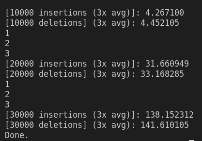

# Requirements

## Hardware
- Tested on debian-like machine (pop-os to be exact), but ubuntu probably works

## Software
- Tested with g++ --version=10.3.0
```
sudo apt-get install g++ // or
sudo apt-get build-essential
```
-  Install **openMP**
```
sudo apt-get install libomp-dev
```
**openMP** is a library that offers support for seamless parallelization through thread launching. As the programmer, you only need to identify parts of your code feeble for parallelization, while the library itself is an abstractions that helps with loop indexing, thread launching, built-in locks, and is portable on different os, making it a nice option for users who don't care about hardware optimations for every different machine. 


# Description

Follow this [youtube link from Geometry Lab](https://www.youtube.com/watch?v=NDGpsfwAaqo&t=705s&ab_channel=GeometryLab) for a more detailed explanation of a skiplist. Here is a summary of the properties of skiplist.

| Insertion | Deletion | Search |
| --------- | -------- | ------ |
| log(n)    | log(n)   | log(n) |

\*expected time

The skiplist is able to achieve these marks because it uses layers/levels of linked list (visually) stacked on top of each other for *skipping* sections of a normal linked list (which has linear time search), and thus tries to emulate the methodology behind *binary search*.

# Coarse-Grain Locking
Coarse-Grain is an adjective that describes something that is granular but still rough in texture. In the context of locking, a **coarse-grain** lock locks the entire data structure itself. For example, say there are 1 threads, t0 and t1. If t0 and t1 one both want to insert an element, and t1 gets the lock first, then t0 will have to wait until t1 unsets the lock before access to **any** part of the data structure. This is in constrast to **fine-grain** locking. 

Coarse-grain locking is easy to implement since we just place a big ol' lock over the data structure access itself. For few threads and infrequent accesses, coarse-grain can be worth the small downside of slower access times (than fine-grain) for a very easy implementation. 

Here are some of my observations:

## Problem Size
|  |
|:--:|
|*# of threads = 1, units are in seconds*|

You see here that coarse grain does not scale very well with problem size. The jump from 10k to 20k insertions is higher (relatively speaking) than 20k to 30k, but for companies that require a skiplist with high scalability with regards to data size, coarse-grain will not cut it. Thus, for the sake of a shorter README, we will not be showing the performance relative to *number of threads* (in fact the performance is actually worse since the overhead of acquring the lock, and the blocking of other threads accessing the list, does not lend itself to high parallelism)
