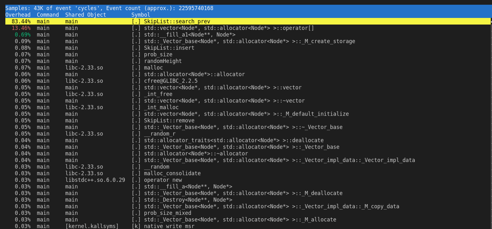
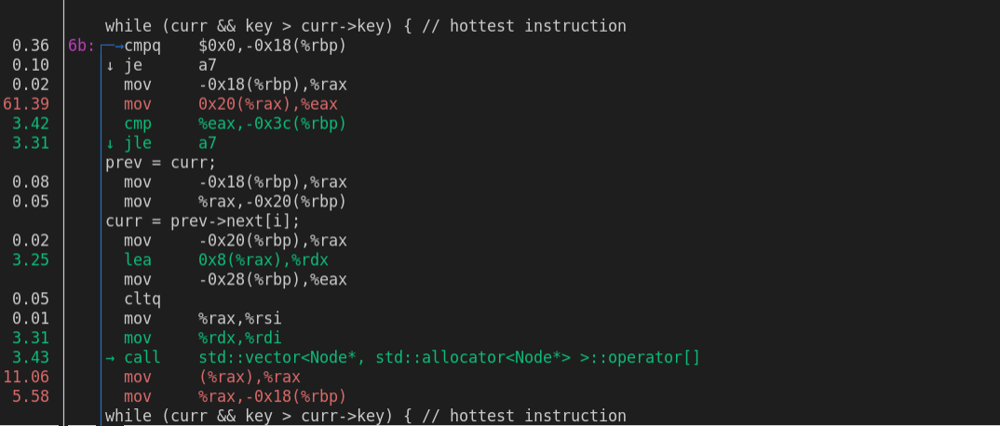

# Requirements

## Hardware
- Tested on debian-like machine (pop-os to be exact), but ubuntu probably works. CPU information can be found https://ark.intel.com/content/www/us/en/ark/products/208658/intel-core-i51135g7-processor-8m-cache-up-to-4-20-ghz.html. Main point is that I have 4 cores, but can run 8 threads ("simultaneously") since intel supports hardware threads.


## Software
- Tested with g++ --version=10.3.0
```
sudo apt-get install g++ // or
sudo apt-get build-essential
```
-  Install **openMP**
```
sudo apt-get install libomp-dev
```

**openMP** is a library that offers support for seamless parallelization through thread launching. As the programmer, you only need to identify parts of your code feeble for parallelization, while the library itself is an abstractions that helps with loop indexing, thread launching, built-in locks, and is portable on different os, making it a nice option for users who don't care about hardware optimations for every different machine. 

# How to Run
```
# for just testing
make test
tests/test -T <test id>
# for just benchmarking
make
src/main -N <numThreads> -T <problem id>
# for testing and benchmarking
# ./run.sh
```
# Description

Follow this [youtube link from Geometry Lab](https://www.youtube.com/watch?v=NDGpsfwAaqo&t=705s&ab_channel=GeometryLab) for a more detailed explanation of a skiplist. Here is a summary of the properties of skiplist. 

| Insertion | Deletion | Search |
| --------- | -------- | ------ |
| log(n)    | log(n)   | log(n) |

\*expected time

The skiplist is able to achieve these marks because it uses layers/levels of linked list (visually) stacked on top of each other for *skipping* sections of a normal linked list (which has linear time search), and thus tries to emulate the methodology behind *binary search*. 


# MetaAnalysis

Before implementing a concurrent data structure, I wanted to know what is the most frequently-run instruction so that I can either A) modify it for compilier optimizations, or B) try calling the instruction less. We look into the assembly and perform metrics by running

## Installation ([here](https://askubuntu.com/questions/50145/how-to-install-perf-monitoring-tool))
```
sudo apt-get install linux-tools-common linux-tools-generic linux-tools-`uname -r`
```

## How to run ([Guide](https://perf.wiki.kernel.org/index.php/Tutorial#Period_and_rate))
```
# creates a perf file
perf record <executable>
# creates a summary of most used instructions
perf report
# Go assembly mode
perf annotate
```
\* Must be `sudo` or `su` to run `perf`. 

## Results

Before getting results, I must describe what I optimized compared to the concurrent versions. First, single-thread performance is very good because:
1) We do not have a complex mutex locking mechanism 
2) We do not keep an array of successors, saving space 
3) We do not use shared_ptrs. I don't have the images for shared_ptrs, but there is actually a lot of overhead in using shared_ptrs to manage the memory for you.



First notice that most of the computation is just in searching and array indexing, so all of the focus will be there



A fundamental operation of the skiplist (or any data structure) is the search operation. In this case, we see that 61.39% of the samples is the `mov 0x20(%rax),%eax`, the instruction in red. This is what is known as the hottest instruction. Regardless, it's nice to know where most of the operations are going towards, and by doing so we can make tiny differences that lead to huge optimizations, like removing `shared_ptrs`

To see the results compared to [fine-grain](https://github.com/bustin11/parallel-skiplist/tree/fine-grain), [coarse-grain](https://github.com/bustin11/parallel-skiplist/tree/coarse-grain), go to here [main](https://github.com/bustin11/parallel-skiplist/tree/main)