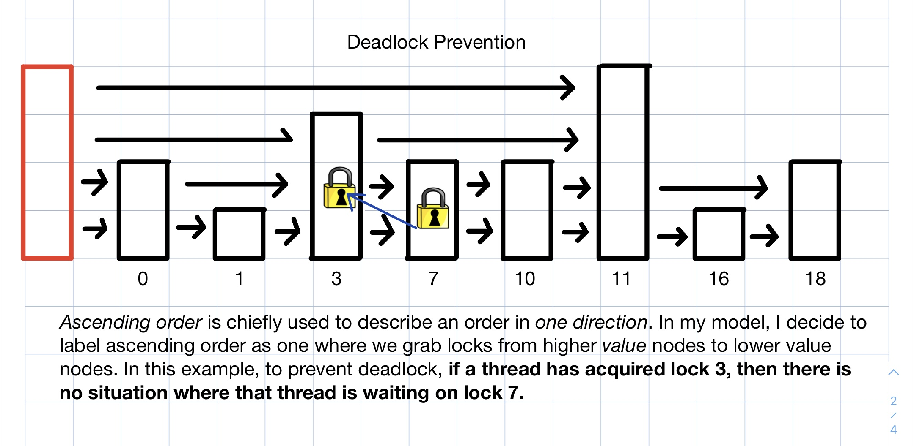
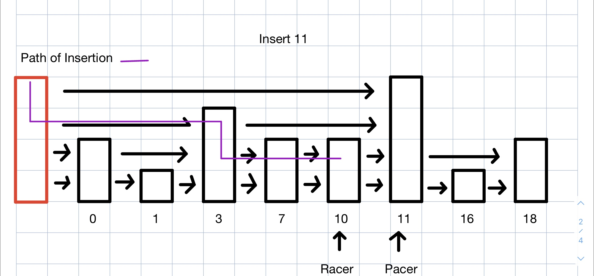
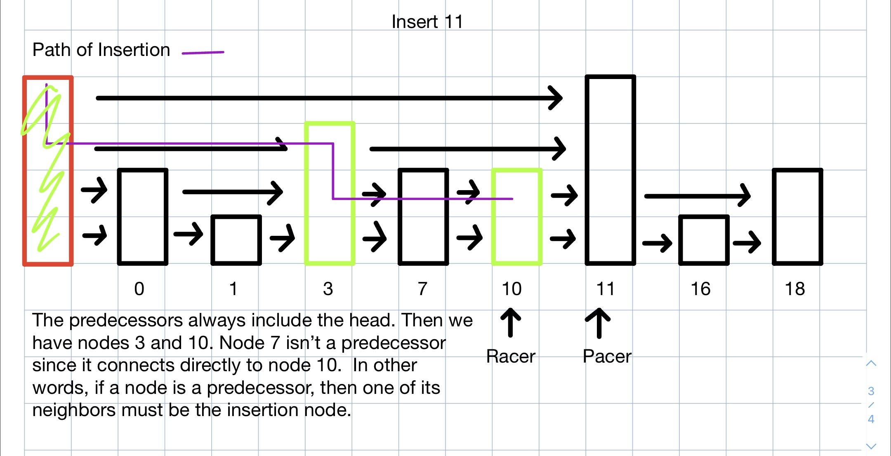
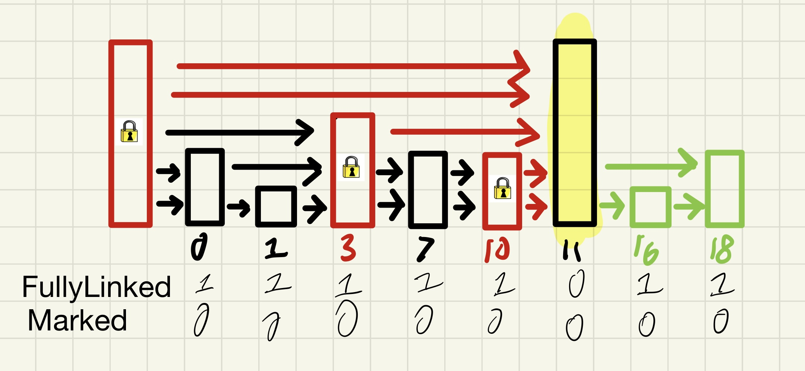
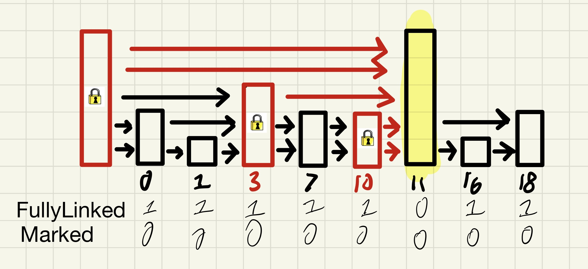

# Requirements

## Hardware
- Tested on debian-like machine (pop-os to be exact), but ubuntu probably works. CPU information can be found https://ark.intel.com/content/www/us/en/ark/products/208658/intel-core-i51135g7-processor-8m-cache-up-to-4-20-ghz.html. Main point is that I have 4 cores, but can run 8 threads ("simultaneously") since intel supports hardware threads.


## Software
- Tested with g++ --version=10.3.0
```
sudo apt-get install g++ // or
sudo apt-get build-essential
```
-  Install **openMP**
```
sudo apt-get install libomp-dev
```

**openMP** is a library that offers support for seamless parallelization through thread launching. As the programmer, you only need to identify parts of your code feeble for parallelization, while the library itself is an abstractions that helps with loop indexing, thread launching, built-in locks, and is portable on different os, making it a nice option for users who don't care about hardware optimations for every different machine. 

# How to Run
```
# for just testing
make test
tests/test -N <numThreads> -T <test id>
# for just benchmarking
make
src/main -N <numThreads> -T <problem id>
# for testing and benchmarking
# ./run.sh
```
# Description

Follow this [youtube link from Geometry Lab](https://www.youtube.com/watch?v=NDGpsfwAaqo&t=705s&ab_channel=GeometryLab) for a more detailed explanation of a skiplist. Here is a summary of the properties of skiplist. 

| Insertion | Deletion | Search |
| --------- | -------- | ------ |
| log(n)    | log(n)   | log(n) |

\*expected time

The skiplist is able to achieve these marks because it uses layers/levels of linked list (visually) stacked on top of each other for *skipping* sections of a normal linked list (which has linear time search), and thus tries to emulate the methodology behind *binary search*. 


In the following sections, I will assume you are familiar with these terms:

|      |                                                                                                                           |
| ---- | --------------------------------------------------------------------------------------------------------------------------
**Node**   | A node is a single object (simliar to a linked list) connected to other multiple nodes. Each node has a specific *height*.
**Head**   | The beginning node. Often labeled as a dummy or sentinel node helpful for insertion and deletion.
**Neighbors**   | The neighbors *from* a *node* are its immediate connections. Note the the skiplist can be implemented as a layer of doubly linked lists, but in my implementation, we use a singly linked lists, so the neighbors are always to the right. 
**Height** | The height of a node is the number connections it connects to. Or it's the number of neighbors to the right. 
**Level**  | The level is the horizontal cross section of the skiplist. For a skiplist of height 5, there are 5 different levels.


In the code, we maintain the **skiplist property**, where higher levels are sublists of lower levels.

Finally, whenever I mention `delete`, it is defined as `remove` in the code itself. (Insert is still insert)

# Fine-Grain Locking
Fine-Grain Locking involves locking subparts of the data structure so that other threads aren't completeing blocked from also accessing the data structure. But there are many issues we have to deal with:

## Deadlock
A situation in a multi-threaded program where 2+ threads are waiting for *each other's* resource (in this case, a lock), and no system-wide progress can be made. Here is a fun analogy: Imagine there are 2 treasure chests, and there are 2 keys that unlock each other's treasure chest. Now if Chest A is locked with Key B, and Chest B is locked with Key A, then no one can open either chests. 

A neat trick we can employ is to grab locks in an *ordered* fashion. In my code, each thread aquires locks in acsending order. We can ensure the absence of deadlock by consider any two locks. Say Thread 1 is holding Lock A, and Thread 2 is holding Lock B. As you can imagine, there is no way where *both* Thread 1 is waiting for Lock A and Thread 2 is waiting for Lock B *if* we require all threads grab in acending order (from lower levels to higher levels)



## Livelock
A situation where supposed system-wide progress is made (because print statements, logs, or threads are showing progress) but in reality, no progress is made due to locks aquiring and releasing locks in a circular loop. An analogy is when 4 cars arrive at an intersection with no stoplight. If all cars reacted the same way, they would all back up so that other cars could cross the intersection. However, if all cars did that, then no cars would cross the intersection. But the "supposed" progress is that we observe the cars moving, but in reality, they are just backing in and out. 

Livelock is difficult to identify because it's naturally sneaky and deceptive. Because we ensure that all locks are aquired in an acsending manner, we know that if a thread fails grabbing a lock, then another thread must hold that lock. But if another thread is holding that lock, then either that thread is waiting for another lock, or it has reached the highest level (so *it's* the holder of that lock). Then we know there is system-wide progress, since once a Thread reaches the highest level, if can perform the subsequent delete or insert operation.

(Insert Image, cars moving back and forth)

## Starvation
Starvation is a matter of fairness. It's a situation where one or more threads are lacking progress for the vitality or progress of other threads. Going back to the Livelock analogy, we can think of just 2 cars driving oncoming and parallel to each, while the other 2 cars are always waiting, stopped at the light, watching the cars drive by. 

There are many ways to ensure fairness. For example, we can use backoff (where a thread that fails to aquire a lock sleeps or does other work before returing the aquire the lock), a ticket lock (where each thread aquires a unique ticket number, and is only allowed to access the lock once the ticket is "called"), an array lock (a ticket lock where each ticket number is padded to reduce traffic interconnect), a queue-based lock(here is nice [read](https://www.quora.com/How-does-an-MCS-lock-work)). *However*, in our code, we must succumb to the implementation of `omp_set_lock` or `omp_test_lock`, neither of which ensures fairness

# Implementation Details
Here, I will go through what I did for each interface of the skiplist. I will also go through the design process as well as the struggles that lead me to my solutions. 

## Iteration 1 (Per-Level Mutex Locking)
My 1st idea was to build upon the idea behind ["Monkey Bar" Locking](http://courses.csail.mit.edu/6.852/08/lectures/Lecture21.pdf). In summary, when traversing a concurrent linked list, we must hold *at least* 1 lock at a time, like swinging on Monkey bars. In other words, when performing a `delete` or `insert` operation, we never release the *prev* lock. And we can guarentee that no other thread is holding the *curr* lock since we maintain the invariant that all threads must hold the *prev* to perform a delete or insertion, thus *curr* should be safe to `delete` or `insert` in between. If we think about a running a track race, *prev* is the racer, and *curr* is the pacer.



Now with this in mind, we can try to perform Monkey Bar Locking on a *per-level* basis. For example, node 3 will have 3 locks. What this entails is that multiple threads can access the same node (but on different levels) 


However, I quickly realize that this will not work due to race conditions. For example: Suppose we try to insert node 11 into the list. Then we would have to lock nodes 10 and 18 at some point. When this happens, we make the connections between nodes 10 and 11, and nodes 11 and 18. However, once it releases those locks for locks 10 and 16 (1 level down), another thread could aquire lock 11 to delete it, causing nasty race conditions, or raising the issue of fairness.

We must look for a coarser solution

## Iteration 2 (Single-Node Mutex Locking)
The next natural idea is to give 1 lock per node. This solves a couple of issues and has some benefits.

1) Per-Node Locking is still cheaper than protecting the entire data structure.
2) We can ensure the locked node itself is not deleted, or been tampered with.
3) We can safely traverse to the neighbors of the locked node because we know, no other thread has inserted a node in between the locked node and its neighbors, or has deleted one of its neighbors. This solves a race condition of reassigning different neighbors, maintaining the skiplist property, and ensuring that memory accesses are safe.

Therefore, when searching for an insertion or deletion point, we must remember its *predecessors*. 



The predecessors are like the backward's neighbors of a node if you will. It is an array(or vector) of *prev* (or racer) nodes that can modify the immediate neighbor connections. If we can lock all the predecessors, then we should be able to perform safe insertions and deletions. 

However, there are still many issues and uncertainties with this design
- How do threads grab/release locks?
- If a thread is *spin-locking*, waiting for another thread to release a lock, how do we know if that node is being deleted? 
- Can we insert a node with the same value if it has not been fully deleted?
- Can we delete a node that hasn't been fully-linked?
- When inserting a node, what happens when the successors change?

As you can imagine, there are many cases that we must handle. Rather than lay them all out for you, I will present the solution that I came up with after read *The Art of Multiprocessor Programming, 2012*

## Iteration 2.1 (Wait-Free Search)
I decided to go for a *Wait-Free* approach for searching because Searching is a read-only operation. Therefore, if I could avoid conjuring read-locks so I could make the concurrent skiplist faster since insertion and deletion rely on search operations. A Wait-Free (or Lock-free) algorithm is one where there is *per-thread* progress. This is subtly different from *system-wide* progress. In per-thread, we know everyone is making progress, while in system-wide, we know at least 1 thread is making progress. 

The approach is simliar to a linked list search, we maintain a prev and curr pointer, and once we travel too far, we jump down a level in O(1) time. Why? Well we still access the same node in memory, causing less cache coherance traffic.

Afterwards, we store the predecessors and successors to be used later on to ensure the local data structure while searching hasn't changed

## Iteration 2.2 (Fine-Grain `Insert`)

A picture is worth a thousand words



We can see here that node 11 is being inserted while the predecessors (in red) and successors (in green) need to be locked[^1]. Why is that the case? Well if first I need to search whether the element exists (otherwise it wouldn't be an ordered set if I inserted whatever I wanted). Then I need to make sure noone else has the predecessors because some other thread could delete the node I'm using. 

Notice that there are two extra states that we need to keep in mind. *Marked* state means that a thread has designated that node to be deleted, and is in the process of being deleted. It is logically deleted. *FullyLinked* means what it sounds. If a node in the process of being inserted, by default, it is not fullylinked. Once all connections have been made, we can release the locks. This is what is called being in the abstract set (of nodes that are present in the list). You are in the process of being inserted, so you can't be deleted.

Now there are 2 implementation details that I need to discuss. 

1) What type of lock will we use? If we use a spinlock, on node 3 for example, and then node 3 inserts a neighbor node 4 with height 3, then the predecessors have changed. Namely, It would be the head, node 4 and node 10. This entails that we must *abort* the operation, otherwise, we wouldn't be able to maintain the skiplist property. This leads me to use a `omp_test_lock`, that returns true if the thread succesfully locked it, otherwise, false. We can put all the functionality in a while loop until abort each time we fail. However, this does not ensure fairness.
2) What happens if we try to insert a marked node? In my case, I just spin until that node is gone from the list, but you could make the case that we could give a litttle more priority to the deletion where seeing marked node means that we can't insert the node. 

I haven't explained all the details (since that's what the code is for), but gave you a sense in the questions and approaches I was taking.

[^1]: Actually we can avoid locking the successors if we check that prev->next == curr. See code for more details.

## Iteration 2.3 (Fine-Grain `Delete`)



Delete is actually very simliar to insert, so I won't bore you with the details, except that we don't need to look at the successors. If they change, we can look at the previous node
s *next* neighbor to reconnect the skiplits.

## Iteration 2.4 (Oh, the bugs I would find!)

I wrote some extensive test cases (see [here](https://github.com/bustin11/parallel-skiplist/tree/fine-grain/tests)), but even with the bugs, I still had to find obscure bugs, some of which would only be available in languages that do NOT do memory management for you.

###  Deleted Memory
When running test cases, I would pass all of them ... except sometimes I wouldn't. You see, I wrote a script to run the test cases 1000 times, and sometimes it would fail, which tells me that I have a bug :( In fact, this bug occurs rarely so I know I either have a race condition, accessing memory that isn't mine, or something more obscure. 

Using vscodes' GDB (modify the Launch.json file), I was able to look at per-thread memory accesses, stepping through code. Now, it isn't perfect because sometimes the threads would get descheduled, so GDB would be buggy, but other than that, I spent hours searching possibly issues. I narrowed it down to the search function, meaning my locking logic was fine, but my wait-free search was incorrect (this would be a fatal assumption). I checked my search function multiple times but found no errors, until I realized that **there is a possiblity that the node being deleted is being traversed by another thread, thus garbling the memory reference itself**.

Standard protocol informs you to not cry in situations like these, and pray when necessary. I fortunately found a solution to this: `shared_ptrs<Node>`. Shared pointers are new construct in c++ that allows the runtime system to manage which pointers are still in scope. Here is analogy: Suppose I have two brothers, all of whom tend to feed a goldfish that we all own. Now the goldfish is alive as along as *at least* 1 other person is still feeding her. If everyone forgets to feed her, then the goldfish dies, and you cannot possibly ask for the same goldfish alive again. You can see where I'm going here? The gold fish is the address in memory, and my brothers and I are the pointers. Now we can remove every `free` or `c++ delete` operation because the runtime system will handle it for us.

### Forbidden Unlocking
After fixing the issue, the errors stopped and now I entered the livelock stage. I would run my code, and there wouldn't be output, so when running the debugger, I found that my code was in an infinite loop in `insert`.

Originally, I had a `highestLocked` variable to keep track of which locks were being locked. If a thread failed to grab all locks, I would simply release all until `highestLocked`. Again this is inspired by `The Art of Multiprocessor Design`. But, there isn't a guartentee that you *always* have exclusive permission to unlock your lock. What I mean is that you could accidentally unlock Thread 2's lock if you're Thread 1. Regardless, I made sure to maintain a [sequentual consistency](https://en.wikipedia.org/wiki/Sequential_consistency) model in mind, trying out every valid interleaving order.

Still stumped, I decided to expliciting create a vector that would enumerate over all locks that I know for sure we acquired, and fortunately, it worked.


To see the results compared to [sequential](https://github.com/bustin11/parallel-skiplist/tree/sequential), [coarse-grain](https://github.com/bustin11/parallel-skiplist/tree/coarse-grain), go to here [main](https://github.com/bustin11/parallel-skiplist/tree/main)

